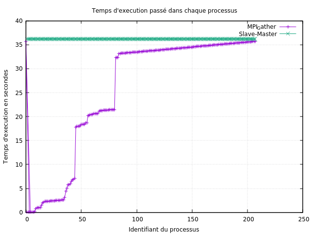

Clement Boin 
Thomas Campistron

# Fractale de mandelbrot

Nous avons fait deux implémentations de cette fractale, une naive entièrement parallélisée qui assemble les bouts de chaque processus avec un `MPI_Gater` et une avec une répartition des charges.

La version avec répartition des charges découpe l'image demandée en plus de bandes qu'il n'y a de processus puis distribue une première fois ces bandes aux processus.
Quand un processus a terminé de calculer une bande alors on lui en donne une nouvelle, de cette manière si une machine est plus longue a calculer une bande alors elle recevra moins de bander à calculer en tout.
Cette méthode a pour inconvéniant de demander plus de communication, on risque donc de perdre en performance si on met trop de bandes.

Ici on observe des temps d'execution similaire avec les données que nous avons mis sauf que la version avec `MPI_Gather` ne répartie pas du tout les calculs.
